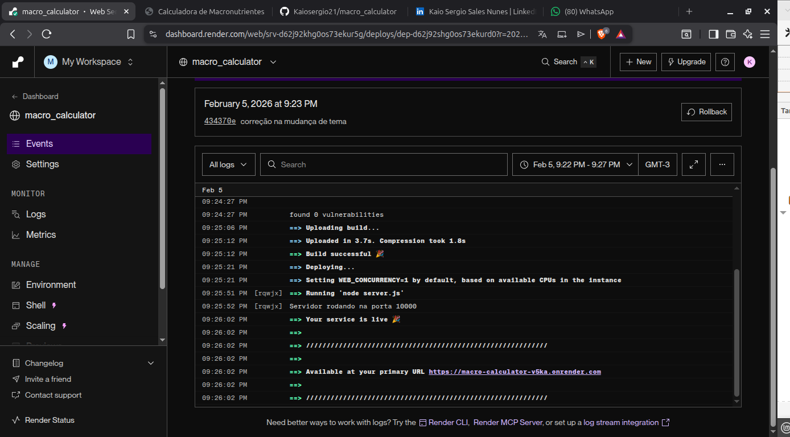

# 🥗 Calculadora de Macronutrientes

# 🥗 Macronutrient Calculator

---

## 📌 Português

Aplicação web que calcula a quantidade diária de calorias e macronutrientes (proteínas, gorduras e carboidratos) com base em dados do usuário como peso, altura, idade, nível de atividade física e objetivo.

⚠️ **Aviso:** Este aplicativo é apenas informativo e **não substitui a orientação de um nutricionista**.

---

## 📸 Screenshots

.
.
.


### 🚀 Funcionalidades

* 📊 Cálculo de calorias diárias
* 🍗 Distribuição de proteínas, gorduras e carboidratos
* 🍽️ Cálculo por refeição
* 🎨 Sistema de temas (verde, azul e vermelho)
* 💾 Tema salvo no navegador (LocalStorage)
* 📱 Layout responsivo (celular, tablet e desktop)

---

### 🛠️ Tecnologias

* HTML5
* CSS3 (variáveis e temas)
* JavaScript
* Node.js
* Express

---

### 📦 Instalação

Clone o repositório:

```bash
git clone https://github.com/Kaiosergio21/macro_calculator.git
```

Entre na pasta:

```bash
cd macro_calculator
```

Instale as dependências:

```bash
npm install
```

Inicie o servidor:

```bash
nodemon server.js
ou
node server.js
```

Abra no navegador:

```
http://localhost:3000
```

---

### 🧮 Como usar

1. Preencha:

   * Peso
   * Altura
   * Idade
   * Sexo
   * Nível de atividade
   * Objetivo
   * Número de refeições

2. Clique em **Calcular**

3. Veja os resultados:

   * Calorias por dia
   * Macronutrientes por dia
   * Macronutrientes por refeição

---

## 🌐 Redes

* GitHub: [https://github.com/Kaiosergio21](https://github.com/Kaiosergio21)
* LinkedIn: [https://www.linkedin.com/in/SEU_PERFIL](https://www.linkedin.com/in/SEU_PERFIL)

---

## 📌 English

Web application that calculates daily calories and macronutrients (proteins, fats, and carbohydrates) based on user data such as weight, height, age, physical activity level, and goal.

⚠️ **Disclaimer:** This application is for informational purposes only and **does not replace professional nutritional guidance**.

---

### 🚀 Features

* 📊 Daily calorie calculation
* 🍗 Protein, fat, and carbohydrate distribution
* 🍽️ Per-meal calculation
* 🎨 Theme system (green, blue, and red)
* 💾 Theme saved in browser (LocalStorage)
* 📱 Responsive layout (mobile, tablet, and desktop)

---

### 🛠️ Technologies

* HTML5
* CSS3 (variables and themes)
* JavaScript
* Node.js
* Express

---

### 📦 Installation

Clone the repository:

```bash
git clone https://github.com/Kaiosergio21/macro_calculator.git
```

Enter the folder:

```bash
cd macro_calculator
```

Install dependencies:

```bash
npm install
```

Start the server:

```bash
nodemon server.js
or
node server.js
```

Open in browser:

```
http://localhost:3000
```

---

### 🧮 How to use

1. Fill in:

   * Weight
   * Height
   * Age
   * Gender
   * Activity level
   * Goal
   * Number of meals

2. Click **Calculate**

3. View:

   * Daily calories
   * Daily macronutrients
   * Macronutrients per meal

---

## 📄 License

This project is intended for educational purposes and personal learning.

---


